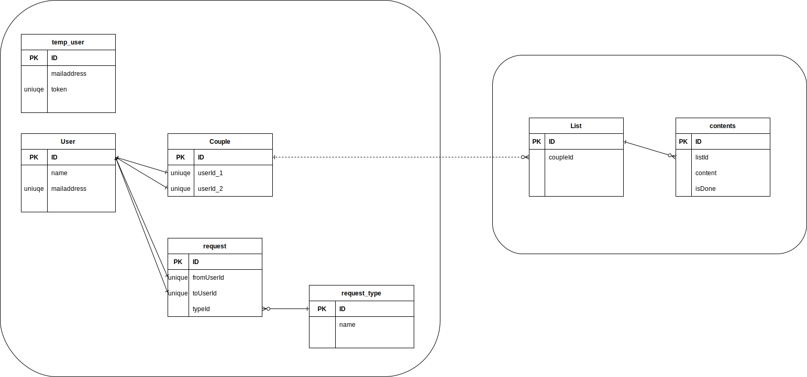

## 概要

- カップル用の todo(行きたいところ)リスト
- (スケジュール)
- (チャット)

## アーキテクチャ/言語

- (なるべく)クリーンアーキテクチャ
- モジュラモノリス
- github(public)
- docker
- Prisma/PostgreSQL
- BE: Typescript/NestJs
- FE: Next.js
- API: GraphQL

## 要件

- 1 つのリストを 2 人(1 組)が crud できる
- 自分の持っているリストしか閲覧できない
- 1 組につき複数リストの作成が可能

## 環境構築

- BE 編
  - BE は[こちら](backend/README.md)
- FE 編
  - FE は[こちら](frontend/README.md)

## ER 図(暫定)

## インフラ(AWS)
※ DBの扱いに関してはベストプラクティスではありません。

